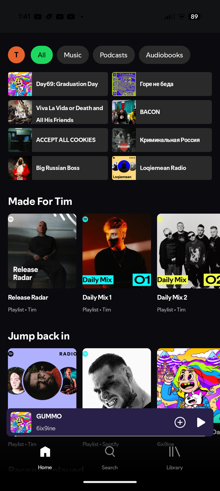

# spotui

A Spotify clone for Android, built with Jetpack Compose.

It connects to your real Spotify account and mirrors the Spotify experience:

- 🎵 **Playlists** — browse, play, add/remove tracks, create new playlists, all synced with your Spotify account
- 📝 **Lyrics** — Spotify's own synced lyrics, with a live preview on the player and a full-screen view
- 📻 **Spotify recommendations** — the queue continues with Spotify's real track radio (autoplay), so "up next" matches what open.spotify.com would play
- ❤️ Liked songs, followed artists, listening history and downloads (including lossless FLAC)

## Screenshot

## Credits

spotui builds on the work of several open-source projects:

- [Meld](https://github.com/) — Spotify metadata + YouTube streaming layer
- [Neptune](https://github.com/navneet851/spotify-clone-jetpack-compose) — the original Jetpack Compose Spotify clone this app started from
- [SpotiFLAC](https://github.com/spotbye/SpotiFLAC) — lossless (FLAC) track resolving
- [SimpMusic](https://github.com/maxrave-dev/SimpMusic) — crossfade / DJ-style audio filter processing

## Disclaimer

This project is for educational purposes only. Spotify is a trademark of Spotify AB.
